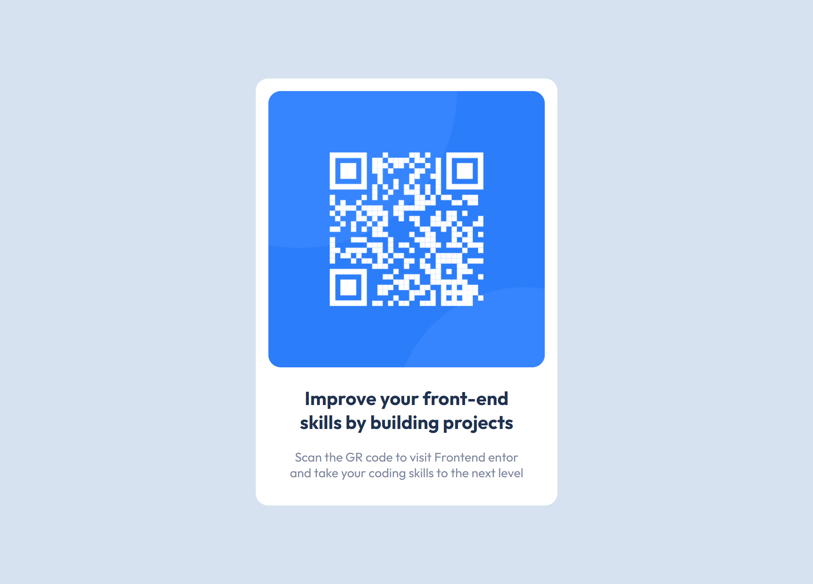

# Frontend Mentor - QR code component solution

This is a solution to the Frontend Mentor challenges. Solution URL: [Add solution URL here]()

### Screenshot

### Built with

- Semantic HTML5 markup
- CSS custom properties
- Flexbox
- Mobile-first workflow-

### What I learned

I learned how to use CSS variables.

## Author

- Juan Diego Acosta Liscano

- X - [Perfil de X](https://twitter.com/juaazn)
- Linkedin - [Perfil de Linkedin](https://www.linkedin.com/in/juan-diego-acosta-liscano-821ba619a/)
